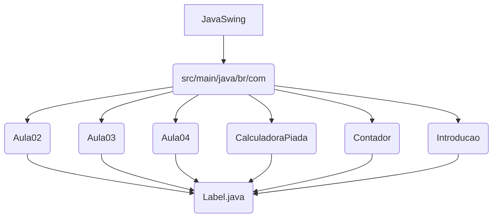

# 🎨 Estudando Java Swing: Aplicações de Interface Gráfica

## 🌟 Status do Projeto

[](https://www.java.com/pt-br/)
[](https://docs.oracle.com/javase/8/docs/api/javax/swing/package-summary.html)
[](https://maven.apache.org/)
[](https://en.wikipedia.org/wiki/Graphical_user_interface)
[](LICENSE)

## 🎯 Visão Geral do Projeto

O repositório **EstudandoJavaSwing** é uma coleção de projetos de estudo e exemplos práticos focados na criação de interfaces gráficas de usuário (GUI) utilizando a biblioteca **Java Swing**. O objetivo principal é explorar os componentes, *layouts*, manipulação de eventos e a estrutura básica de aplicações desktop em Java.

Cada subdiretório representa um tópico ou uma aplicação de exemplo, servindo como um laboratório para o aprendizado e a prática de conceitos de GUI.

## 🏛 Arquitetura e Design de Software

O projeto é estruturado como um conjunto de módulos de estudo, onde cada módulo (pacote) foca em um aspecto específico do Swing. A arquitetura é tipicamente **orientada a objetos**, com classes dedicadas à criação e configuração de janelas (`JFrame`) e componentes (`JLabel`, `JButton`, etc.).

### Estrutura de Módulos

O código-fonte está organizado em pacotes que refletem os tópicos de estudo:

| Pacote (Exemplo) | Foco Principal | Componentes Explorados |
| :--- | :--- | :--- |
| `br.com.Aula02` | Configuração de `JLabel` | `JFrame`, `JLabel`, `ImageIcon`, `BorderFactory` |
| `br.com.Aula03` | Manipulação de Eventos | `JButton`, `ActionListener`, `JOptionPane` |
| `br.com.Aula04` | *Layout Managers* | `FlowLayout`, `BorderLayout`, `GridLayout` |
| `br.com.Introducao` | Estrutura Básica de Janela | `JFrame`, `System.exit(0)` |
| `br.com.CalculadoraPiada` | Aplicação Completa | Combinação de componentes e lógica de eventos |
| `br.com.Contador` | Aplicação Completa | Combinação de componentes e lógica de eventos |

### Diagrama de Pacotes (Representação Textual)

O projeto segue uma estrutura modular para isolar os conceitos de estudo:



## ✨ Funcionalidades Principais

As funcionalidades são didáticas e demonstram o uso de:

*   **Criação de Janelas:** Utilização de `JFrame` para a construção da janela principal.
*   **Componentes Visuais:** Exploração de `JLabel` (rótulos), `JButton` (botões) e outros elementos de interação.
*   **Manipulação de Imagens:** Uso de `ImageIcon` para incorporar recursos visuais (ex: `exempoIcon.png`).
*   **Eventos:** Implementação de `ActionListener` para responder a interações do usuário (cliques de botão).
*   **Layouts:** Prática com diferentes gerenciadores de layout para organizar componentes na tela.

## 🛠 Dependências

O projeto é construído com Java SE e utiliza o Maven para gerenciamento de dependências e *build*. Não há dependências externas além das bibliotecas padrão do Java Swing.

## ⚙ Pré-requisitos

*   **Java Development Kit (JDK)**: Versão 17 ou superior.
*   **Apache Maven**: Versão 3.x ou superior.

## 🚀 Instalação e Execução

Como o repositório contém múltiplos exemplos em diferentes pacotes, a execução deve ser feita especificando a classe principal de cada módulo.

### 1. Clonagem e Compilação

A partir do diretório raiz do projeto (`EstudandoJavaSwing/`):

```bash
# 1. Clone o repositório
git clone https://github.com/GilvanPedro/EstudandoJavaSwing.git
cd EstudandoJavaSwing/JavaSwing

# 2. Compile o projeto
mvn clean compile
```

### 2. Execução de um Módulo Específico

Para executar um dos exemplos, utilize o comando `mvn exec:java`, especificando a classe principal completa (incluindo o pacote).

**Exemplo: Executando a Aula 02 (Label.java)**

```bash
mvn exec:java -Dexec.mainClass="br.com.Aula02.Label"
```

**Exemplo: Executando a Calculadora Piada**

```bash
mvn exec:java -Dexec.mainClass="br.com.CalculadoraPiada.Main"
```

## 🖼 Exemplo Visual (Simulação)

Ao executar um dos módulos, uma janela de aplicação desktop será exibida.

**Simulação da Janela (Módulo Aula02 - Label):**

```
+-------------------------------------------------+
| Janela de Estudo (JFrame)                       |
+-------------------------------------------------+
| [Ícone] Você ao menos programa?                 |
|                                                 |
|  [Rótulo com Borda Vermelha]                    |
|                                                 |
|                                                 |
+-------------------------------------------------+
```

## 📄 Licença

Este projeto está sob a **Licença MIT**.

## 🧑‍💻 Autor

Este projeto foi desenvolvido por [Gilvan Pedro](https://github.com/GilvanPedro).
